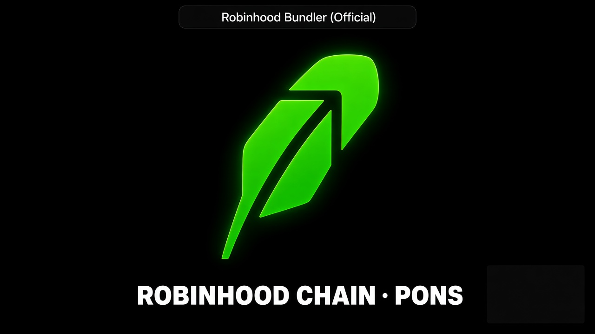
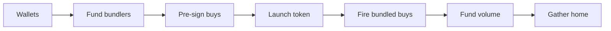

# Robinhood Bundler

Professional desktop toolkit for launching and managing tokens on [Pons](https://ponsfamily.com/) · Robinhood Chain.

<!-- Replace VIDEO_ID when the intro is live. -->
[](https://www.youtube.com/watch?v=VIDEO_ID)

This repo is the static Vite + React download site. Binaries are served from Vercel Blob.

---

## How the bundler works

Robinhood Bundler is a native desktop app (Windows, Linux, macOS). End users do not install Node. Private keys stay on the device. **Dry run** is the default — switch to **Live** only when you are ready to spend ETH.

Tabs: **Launch** · **Wallets** · **Volume** · **Gather**.



**Launch Bundle** (`bundle`) runs in this order:

1. Resolve or generate bundler wallets (disjoint from the deployer).
2. Fund bundlers, wrap WETH, approve SwapRouter.
3. Pre-sign SwapRouter buys against the predicted or deployed token.
4. Launch — **Pons factory** on mainnet, or **custom** `BundlerLauncherToken` + Uniswap V3 LP when Pons is unavailable (testnet).
5. Wait until trading opens, then fire the pre-signed buys.
6. Fund volume wallets. Volume is **not** auto-bought — you trigger it later.

**Gather** claims creator fees, sells tokens, unwraps WETH, and sweeps ETH back to the deployer.

---

## Downloads

```bash
npm install
npm run dev
npm run build
```

| File | Platform | Blob |
|---|---|---|
| `RobinhoodBundler-setup.exe` | Windows installer | [setup](https://8kncbrfxzyjag1dk.public.blob.vercel-storage.com/RobinhoodBundler_1.0.0_x64-setup.exe) |
| `RobinhoodBundler.AppImage` | Linux AppImage | [AppImage](https://8kncbrfxzyjag1dk.public.blob.vercel-storage.com/RobinhoodBundler_1.0.0_amd64.AppImage) |
| `RobinhoodBundler.deb` | Debian / Ubuntu | [deb](https://8kncbrfxzyjag1dk.public.blob.vercel-storage.com/RobinhoodBundler_1.0.0_amd64.deb) |
| `RobinhoodBundler.dmg` | macOS (Apple Silicon) | [dmg](https://8kncbrfxzyjag1dk.public.blob.vercel-storage.com/RobinhoodBundler_1.0.0_aarch64.dmg) |
| `RobinhoodBundler-mac.zip` | macOS zip fallback | [zip](https://8kncbrfxzyjag1dk.public.blob.vercel-storage.com/RobinhoodBundler_1.0.0_macos.zip) |

---

## Verified on testnet

Live custom launches on Robinhood Chain **testnet** (chain ID **46630**), 2026-09-05. Explorer: [explorer.testnet.chain.robinhood.com](https://explorer.testnet.chain.robinhood.com). Source: `robin/logs/robinbundler-2026-09-05.log`. No private keys.

Pons factory is not deployed on testnet, so Launch used **custom** mode (BundlerLauncherToken + Uni V3 LP, 85% burn).

### Launch index

| Token | Pool | Mint LP | Explorer |
|---|---|---|---|
| E2E LXB7 `0xa05de8d3…43bea` | `0x20653d45…ef6c0` | [`0x76f98fc9…2625b`](https://explorer.testnet.chain.robinhood.com/tx/0x76f98fc92124c3114460a3e9b07e6d73e567719da57ee4439516a8f6e7c2625b) | [token](https://explorer.testnet.chain.robinhood.com/token/0xa05De8D3302aa9e711365Cf98EC8B0CEE5043BeA) |
| Follish Dev `0x1a69780e…39981` | `0x1cbf4202…fc3ea` | [`0x46f9e126…ab2bc`](https://explorer.testnet.chain.robinhood.com/tx/0x46f9e12602abdb5589a29848800086bbc1fb89b5ff24508f45ad3b193c5ab2bc) | [token](https://explorer.testnet.chain.robinhood.com/token/0x1A69780E1c186FaD1144D24F11347beb5DD39981) |
| Follish Dev XXX `0x8c5d5ffb…2ac42` | `0x281fbbbd…c676c` | [`0xaf03b4cd…06227`](https://explorer.testnet.chain.robinhood.com/tx/0xaf03b4cdd4953a765509f1cfc51579e956b4b3384709e0b0c587674a0e106227) | [token](https://explorer.testnet.chain.robinhood.com/token/0x8c5D5FFb7C7332eBA469cBbD2a117383e182AC42) |

### Featured run — Follish Dev XXX

Last complete live pipeline (token [`0x8c5d5ffb…2ac42`](https://explorer.testnet.chain.robinhood.com/token/0x8c5D5FFb7C7332eBA469cBbD2a117383e182AC42), LP NFT 413, 85% burn).

| Stage | Transaction |
|---|---|
| Deploy token | [`0xb0275b95…f9a6f2`](https://explorer.testnet.chain.robinhood.com/tx/0xb0275b951525a8963f854370778b0c18e1d96b4f40eb7c0c5cb304d500f9a6f2) |
| Create pool | [`0xcd615f38…a7eaf3`](https://explorer.testnet.chain.robinhood.com/tx/0xcd615f386342cec061b701377c99347153174b78c00d0275f376368494a7eaf3) |
| Mint LP | [`0xaf03b4cd…06227`](https://explorer.testnet.chain.robinhood.com/tx/0xaf03b4cdd4953a765509f1cfc51579e956b4b3384709e0b0c587674a0e106227) |
| Creator buy | [`0x863a2b84…f3368d`](https://explorer.testnet.chain.robinhood.com/tx/0x863a2b849e992883bb1cbef075169e0015ff1cd8d7590076e5def6a011f3368d) |
| Bundled buy 1 | [`0x970ac29a…f56e5`](https://explorer.testnet.chain.robinhood.com/tx/0x970ac29af9c1a37c418f83f18d9f5f75ac9abdfa55c7c438f975bc92d5df56e5) |
| Bundled buy 2 | [`0xe49b1025…dd4db`](https://explorer.testnet.chain.robinhood.com/tx/0xe49b10253d6c197666564f75eb3047864e9a3f4a1e2495260a9d2378a3add4db) |
| Gather sell (deployer) | [`0x1f4b47ea…91f753`](https://explorer.testnet.chain.robinhood.com/tx/0x1f4b47ea5efc63a1a53af2992f802b949d84a1fd1e6023bcc7b8b609f891f753) |
| Gather sell (bundler) | [`0x062f5c36…793e0e`](https://explorer.testnet.chain.robinhood.com/tx/0x062f5c36f04ca0d0a35c311143a713733f61c857033171abfa04b1553e793e0e) |
| Gather sell (bundler) | [`0x22988623…74af4c`](https://explorer.testnet.chain.robinhood.com/tx/0x2298862325108364aff729ca0eb028b6223d40915b71b8424c24cfb37874af4c) |

The first UI E2E gather on E2E LXB7 failed: bundler `0x06e30b92…` had insufficient gas. Later runs completed sell → unwrap → sweep.

---

Robinhood Bundler is independent software for public Pons contracts on Robinhood Chain. Not affiliated with Pons, Robinhood, or their affiliates. Provided as-is, without warranty. Token launches are high risk — never spend more than you can afford to lose. Always start in Dry run.
