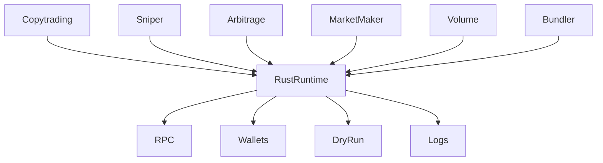
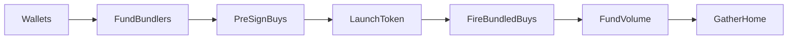

# Robinhood Trading Bot

Native **Rust** operator suite for [Robinhood Chain](https://explorer.chain.robinhood.com) (chain ID **4663**) and [Pons](https://ponsfamily.com/). One control surface for launch, execution, and recovery — without juggling scripts, terminals, or scattered configs.

Private keys stay on your machine. **Dry run** is the default — switch to **Live** only when you are ready to spend ETH.

Independent software. Not affiliated with Pons, Robinhood, or their affiliates.

This repo is the static Vite + React download site. Binaries are served from Vercel Blob.

<!-- Replace VIDEO_ID when the intro is live. -->


Watch how Robinhood Bundler works: https://youtu.be/vayW_41kZdo

---

## Modules

| Module | Role |
|---|---|
| [Bundler](#robinhood-bundler) | Launch a token, pre-sign buys, fire when trading opens, then Gather |
| [Sniper](#robinhood-sniper-bot) | Watch new pools and trading-open; submit prepared buys with cap and slippage guards |
| [Copytrading](#robinhood-copytrading-bot) | Follow a wallet or set of wallets on-chain with size, delay, and max-notional controls |
| [Arbitrage](#robinhood-arbitrage-bot) | Quote across Uniswap V3 and Pancake V3; trade only when spread covers gas and slippage |
| [Market Maker](#robinhood-market-maker-bot) | Inventory-aware two-sided quotes with named strategies |
| [Volume booster](#robinhood-volume-booster) | Optional activity bots you trigger yourself — Launch funds wallets, it does not auto-buy |

---

## Architecture

Shared Rust runtime: RPC, wallets, dry-run, and logs. Modules plug in; they do not hold keys of their own.



---

## Why Rust

- **Latency** — tokio async I/O and a tight hot path for quotes, watches, and signed submits
- **Single binary** — no Node runtime for operators; alloy talks to the chain
- **Keys never leave the box** — generate, fund, and sign locally; nothing is uploaded unless you choose to share it

Packaged Bundler builds (Windows `.exe`, Linux AppImage / `.deb`, macOS `.dmg`) are listed under [Downloads](#downloads). End users do not install Node.

---

## Robinhood Bundler

Launch and manage tokens on Pons · Robinhood Chain. Native desktop app (Windows, Linux, macOS). Generate disjoint wallets, fund and wrap, pre-sign SwapRouter buys, launch, fire when trading opens, then Gather.

Tabs: **Launch** · **Wallets** · **Volume** · **Gather**.



**Launch Bundle** (`bundle`) runs in this order:

1. Resolve or generate bundler wallets (disjoint from the deployer).
2. Fund bundlers, wrap WETH, approve SwapRouter.
3. Pre-sign SwapRouter buys against the predicted or deployed token.
4. Launch — **Pons factory** on mainnet, or **custom** `BundlerLauncherToken` + Uniswap V3 LP when Pons is unavailable (testnet).
5. Wait until trading opens, then fire the pre-signed buys.
6. Fund volume wallets. Volume is **not** auto-bought — you trigger it later.

**Gather** claims creator fees, sells tokens, unwraps WETH, and sweeps ETH back to the deployer.

**Operator controls:** token metadata and logo, bundler count and per-wallet buy size, launch mode (Pons / custom), LP burn bps, dry-run / live, Gather (all / bundler / volume / claim).

---

## Robinhood Sniper Bot

Watch new pools and trading-open, then submit **prepared** buys with cap and slippage guards. Same idea as the bundler’s pre-sign-then-fire path: the order is signed ahead of time; the submit waits until the pool is tradable.

**When you use it:** you already know the token or factory you care about, and you want the buy ready before trading opens — not a scramble after the first block.

**Operator controls:** watch list (token / pair / factory), max cap, slippage, gas ceiling, dry-run first. Cap safety re-quotes and re-signs after the pool exists, the same way bundled buys do.

---

## Robinhood Copytrading Bot

Follow a wallet or a set of wallets on-chain. When they buy or sell, the bot sizes a matching order on your side — within the limits you set.

**When you use it:** you want to mirror a known deployer, trader, or bundle wallet without sitting on the explorer.

**Operator controls:** source address(es), size (fixed ETH or ratio of the source fill), delay, max notional per trade and per session, exclude list (your own deployer, bundlers, volume wallets), dry-run first.

---

## Robinhood Arbitrage Bot

Quote the same pair across **Uniswap V3** and **Pancake V3**. Trade only when the spread covers gas and slippage. Quotes try each DEX stack until one returns liquidity; a trade that does not clear the cost floor is skipped.

**When you use it:** a token trades on more than one V3 stack (the same layout used on Robinhood Chain mainnet and testnet), and you want a mechanical check before you spend gas.

**Operator controls:** pair list, min spread after gas, slippage, max size, poll interval, dry-run first.

---

## Robinhood Market Maker Bot

Inventory-aware two-sided quotes. Strategies share names with the volume engine so a wallet can run the same playbook from either module:

| Strategy | Intent |
|---|---|
| `pulse` | Steady two-sided prints inside a delay band |
| `bias_up` | Lean buy; smaller sells |
| `bias_down` | Lean sell; larger sells |
| `range_chop` | Fade moves around an EMA |
| `burst` | Short bursts, then idle |
| `inventory` | Rebalance toward a target token / WETH mix |

**When you use it:** you hold inventory in a pool and want quotes that respect balances, gas reserve, and min/max trade size — not a one-shot dump.

**Operator controls:** strategy per wallet, min/max trade size, delay band, buy-bias bps, sell-bps min/max, gas reserve, dry-run first.

---

## Robinhood Volume Booster

Optional activity bots **you trigger yourself**. Launch Bundle funds and preps volume wallets; it does **not** auto-buy. Trigger is a separate action.

**When you use it:** after launch, when you want per-wallet activity on a token you already created. Wallets must exist (Bundle / Fund / Generate) before Trigger.

**Operator controls:** wallet count, per-wallet amount, strategy (`pulse`, `bias_up`, `bias_down`, `range_chop`, `burst`, `inventory`), period, repeats, which wallets are included in Trigger all. Trigger does not create wallets.

---

## Downloads

Packaged Bundler app — Windows, Linux, macOS. Keys stay on the device.

```bash
npm install
npm run dev
npm run build
```

| File | Platform | Blob |
|---|---|---|
| `RobinhoodBundler-setup.exe` | Windows installer | [setup](https://8kncbrfxzyjag1dk.public.blob.vercel-storage.com/RobinhoodBundler_1.0.0_x64-setup.exe) |
| `RobinhoodBundler.AppImage` | Linux AppImage | [AppImage](https://8kncbrfxzyjag1dk.public.blob.vercel-storage.com/RobinhoodBundler_1.0.0_amd64.AppImage) |
| `RobinhoodBundler.deb` | Debian / Ubuntu | [deb](https://8kncbrfxzyjag1dk.public.blob.vercel-storage.com/RobinhoodBundler_1.0.0_amd64.deb) |
| `RobinhoodBundler.dmg` | macOS (Apple Silicon) | [dmg](https://8kncbrfxzyjag1dk.public.blob.vercel-storage.com/RobinhoodBundler_1.0.0_aarch64.dmg) |
| `RobinhoodBundler-mac.zip` | macOS zip fallback | [zip](https://8kncbrfxzyjag1dk.public.blob.vercel-storage.com/RobinhoodBundler_1.0.0_macos.zip) |

**Requirements:** Windows 10/11, macOS, or Linux (x64) · ETH on Robinhood Chain for live launches.

---

## Verified on testnet

Live custom launches on Robinhood Chain **testnet** (chain ID **46630**), 2026-09-05. Explorer: [explorer.testnet.chain.robinhood.com](https://explorer.testnet.chain.robinhood.com). Source: `robin/logs/robinbundler-2026-09-05.log`. No private keys.

Pons factory is not deployed on testnet, so Launch used **custom** mode (BundlerLauncherToken + Uni V3 LP, 85% burn).

### Launch index

| Token | Pool | Mint LP | Explorer |
|---|---|---|---|
| E2E LXB7 `0xa05de8d3…43bea` | `0x20653d45…ef6c0` | [`0x76f98fc9…2625b`](https://explorer.testnet.chain.robinhood.com/tx/0x76f98fc92124c3114460a3e9b07e6d73e567719da57ee4439516a8f6e7c2625b) | [token](https://explorer.testnet.chain.robinhood.com/token/0xa05De8D3302aa9e711365Cf98EC8B0CEE5043BeA) |
| Follish Dev `0x1a69780e…39981` | `0x1cbf4202…fc3ea` | [`0x46f9e126…ab2bc`](https://explorer.testnet.chain.robinhood.com/tx/0x46f9e12602abdb5589a29848800086bbc1fb89b5ff24508f45ad3b193c5ab2bc) | [token](https://explorer.testnet.chain.robinhood.com/token/0x1A69780E1c186FaD1144D24F11347beb5DD39981) |
| Follish Dev XXX `0x8c5d5ffb…2ac42` | `0x281fbbbd…c676c` | [`0xaf03b4cd…06227`](https://explorer.testnet.chain.robinhood.com/tx/0xaf03b4cdd4953a765509f1cfc51579e956b4b3384709e0b0c587674a0e106227) | [token](https://explorer.testnet.chain.robinhood.com/token/0x8c5D5FFb7C7332eBA469cBbD2a117383e182AC42) |

### Featured run — Follish Dev XXX

Last complete live pipeline (token [`0x8c5d5ffb…2ac42`](https://explorer.testnet.chain.robinhood.com/token/0x8c5D5FFb7C7332eBA469cBbD2a117383e182AC42), LP NFT 413, 85% burn).

| Stage | Transaction |
|---|---|
| Deploy token | [`0xb0275b95…f9a6f2`](https://explorer.testnet.chain.robinhood.com/tx/0xb0275b951525a8963f854370778b0c18e1d96b4f40eb7c0c5cb304d500f9a6f2) |
| Create pool | [`0xcd615f38…a7eaf3`](https://explorer.testnet.chain.robinhood.com/tx/0xcd615f386342cec061b701377c99347153174b78c00d0275f376368494a7eaf3) |
| Mint LP | [`0xaf03b4cd…06227`](https://explorer.testnet.chain.robinhood.com/tx/0xaf03b4cdd4953a765509f1cfc51579e956b4b3384709e0b0c587674a0e106227) |
| Creator buy | [`0x863a2b84…f3368d`](https://explorer.testnet.chain.robinhood.com/tx/0x863a2b849e992883bb1cbef075169e0015ff1cd8d7590076e5def6a011f3368d) |
| Bundled buy 1 | [`0x970ac29a…f56e5`](https://explorer.testnet.chain.robinhood.com/tx/0x970ac29af9c1a37c418f83f18d9f5f75ac9abdfa55c7c438f975bc92d5df56e5) |
| Bundled buy 2 | [`0xe49b1025…dd4db`](https://explorer.testnet.chain.robinhood.com/tx/0xe49b10253d6c197666564f75eb3047864e9a3f4a1e2495260a9d2378a3add4db) |
| Gather sell (deployer) | [`0x1f4b47ea…91f753`](https://explorer.testnet.chain.robinhood.com/tx/0x1f4b47ea5efc63a1a53af2992f802b949d84a1fd1e6023bcc7b8b609f891f753) |
| Gather sell (bundler) | [`0x062f5c36…793e0e`](https://explorer.testnet.chain.robinhood.com/tx/0x062f5c36f04ca0d0a35c311143a713733f61c857033171abfa04b1553e793e0e) |
| Gather sell (bundler) | [`0x22988623…74af4c`](https://explorer.testnet.chain.robinhood.com/tx/0x2298862325108364aff729ca0eb028b6223d40915b71b8424c24cfb37874af4c) |

The first UI E2E gather on E2E LXB7 failed: bundler `0x06e30b92…` had insufficient gas. Later runs completed sell → unwrap → sweep.

---

## Safety

- **Dry run** is the default. Rehearse every path before Live.
- **Disjoint wallet sets** — deployer, bundlers, and volume wallets must not overlap.
- **Private keys stay on your device.** Generate and sign locally.
- You are responsible for funds, keys, and compliance in your jurisdiction.
- Token launches and automated trading are high risk — never spend more than you can afford to lose.

---

## Support

Questions or partnership inquiries — [Bo$onaX](https://t.me/bosonax) on Telegram.

---

## License & notice

© Robinhood Trading Bot. All rights reserved.

Robinhood Trading Bot is independent software for public contracts on Robinhood Chain. Not affiliated with Pons, Robinhood, or their affiliates. Provided as-is, without warranty. Token launches are high risk — never spend more than you can afford to lose. Always start in Dry run.
